# SyntheticMarket

**Experiment: can a neural network learn to predict price direction from purely synthetic (generated) financial data?**

A personal research project, not a production system — a lab experiment testing whether an LSTM can find predictive signal in synthetic market data.

---

## TL;DR

The hypothesis that synthetic data would be predictable **did not hold up** — and that's actually the interesting, informative result. The model correctly learned to predict the unconditional class distribution (the prior) and hit a hard floor equal to the entropy of the label distribution, because the underlying generator is an i.i.d. random walk with no memory — there is nothing in it to predict. The project shifted from "train a neural net on fake charts" into a demonstration of **why this fails without explicitly built-in structure** (autocorrelation, volatility clustering) — a useful takeaway for anyone considering synthetic data for trading models.

---

## Hypothesis

> If you generate realistic-looking OHLCV candles (a random walk with Gaussian/Student-t noise on price increments) and train an LSTM classifier for direction (up / down / flat), the model should be able to find predictive signal better than chance.

More specifically, two sub-hypotheses were tested:

1. **H1:** An LSTM can extract useful patterns from a window of past candles (60-90 minutes) to predict direction 5 minutes ahead.
2. **H2:** The more "realistic" the noise distribution (Gaussian and Student-t instead of uniform), the better the prediction quality.

---

## Experiment architecture

```

data/synthetic/     → generated datasets (parquet), many independent seeds
data/real/          → real exchange data, held out to check the reality gap
models/*
dataset-generation.ipynb    → showcase of OHLC data generation
train.ipynb                 → training model
valuation.ipynb             → testing model in real conditions (100 random BTCUSDT intervals)
dataWorker.py               → worker for collecting data for exchange
model.py                    → LSTMClassifier class
```

## Data generator

Price is modeled as a driftless random walk:

```python
price_c = price_o + distribution(sigma=body_sigma, mode="gauss")
price_h = max(price_o, price_c) + abs(distribution(sigma=wick_sigma, mode="student_t", df=wick_df))
price_l = min(price_o, price_c) - abs(distribution(sigma=wick_sigma, mode="student_t", df=wick_df))
```

The generator went through several iterations: `uniform` → `gauss` → `gauss + student_t`. In my opinion combining gauss for body generation adn student_t for wick generation is a best practice to achive a real-looking OHLC chart

| 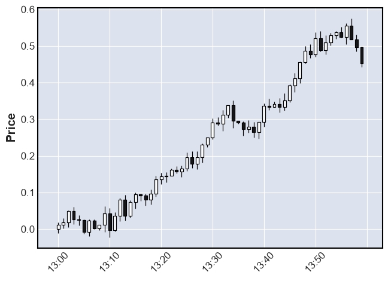 | 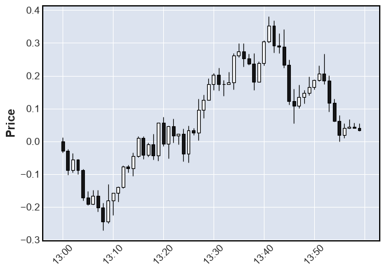 | 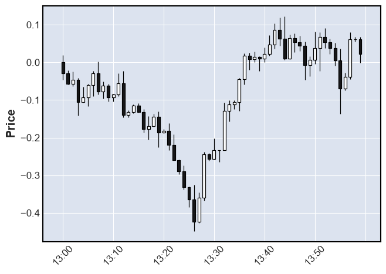 |
|:---:|:---:|:---:|
| Unifrom | Gauss | Gauss + Student T |


### Comparison of different `sigma` and `df` values on same seed

`body_sigma` determines the range of each candle; increasing this parameter increases volatility.

`wick_sigma` increases the size of the wicks on each candle; at higher values, the chart looks more like that of a low-cap coin.

`wick_df` determines the dispersion of the wicks. The lower the value, the more frequently anomalies in the form of huge wicks will appear; at a value of 25, the distribution is almost indistinguishable from a Gaussian distribution.

### `wick_sigma` examples

|  | 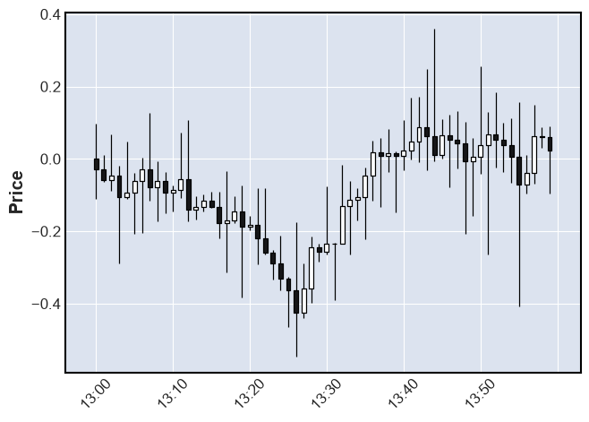 |
|:---:|:---:|
| 0.02 | 0.1 |

### `wick_df` examples

|  | 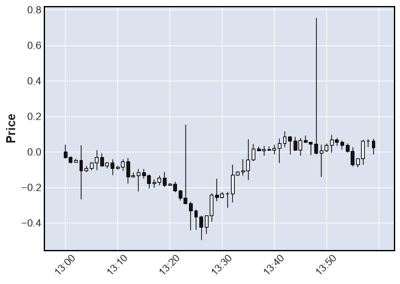 | 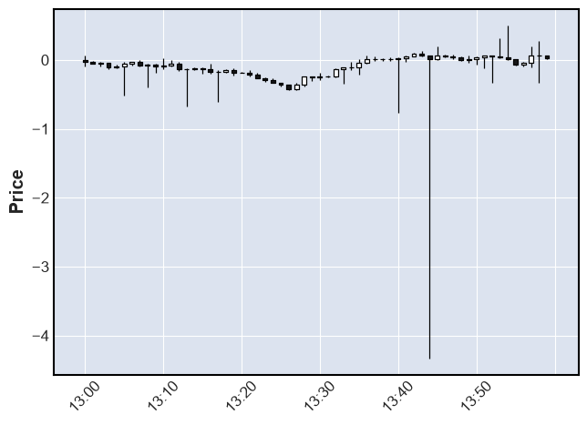 |
|:---:|:---:|:---:|
| 5+ | 2 | 1 |

### Model

```python
LSTMClassifier(
    n_features=4,     # return, high_low_range, body, volume_norm
    hidden_size=64,
    num_layers=2,
    num_classes=3,    # down / flat / up
    dropout=0.2
)
```

Task: classify price direction `horizon=5` minutes ahead, using a `window=120`-minute context.

---


## First Model

**Dataset:** ~1440 minutes of synthetic candles (`gauss + student_t`, `sigma=0.046`, `df=23`), 80/20 time-based train/val split.

**Training:** 450 epochs, Adam (`lr=1e-3`), CrossEntropyLoss.


### Evaluation

`trains_loss` ~ 0.08 at the end of training

First evaluation shows `~53%` winrate with total profit of 260 points. But after a few another testings average winrate drops to `~50%` and `~46%`

Even with winrate of 46% model sometimes can predict _profitably_. I assume this profitable prediction just a deviation and its depends oт tested intervals


|  | Profit | Winrate | 
| :---------: | :---------: | :----------: |
| First Test | 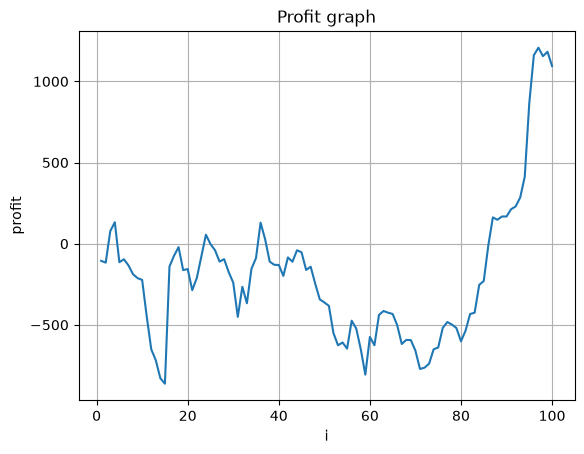</img> | 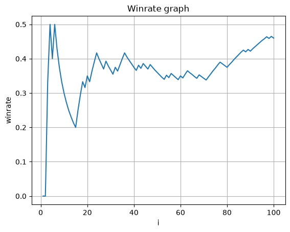</img> | 
| Second Test | 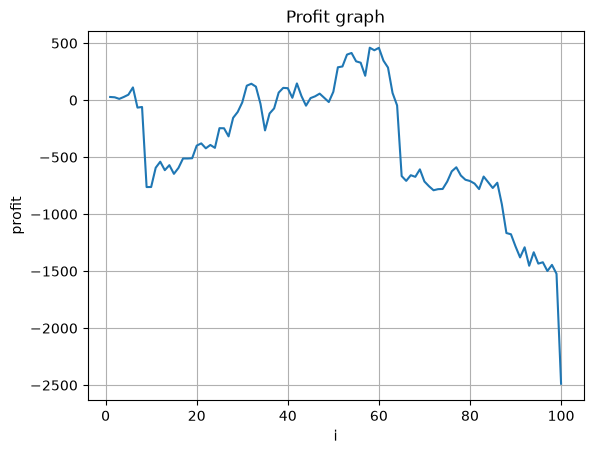</img> | 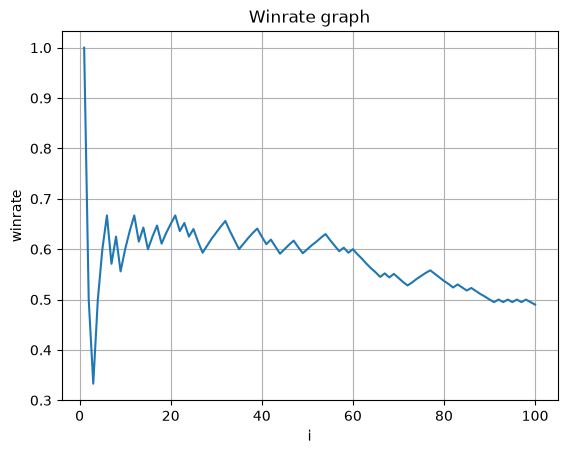</img> | 


Previously, I used a suboptimal method for calculating profit—specifically, `close_price - open_price`.
The new strategy adds stop-loss and take-profit levels.
Risk on the pseudo-trade 10 points; Risk/Reward: 5.

I also changed the testing strategy. Instead of using 100 random intervals obtained in real-time, I save the BTCUSDT history for seven months (and later, a full year) once, and then iterate through that history during the test.


<div align="center">
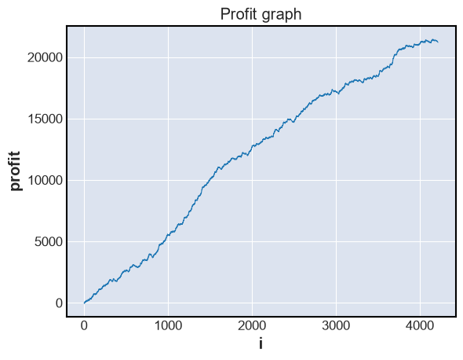</img>
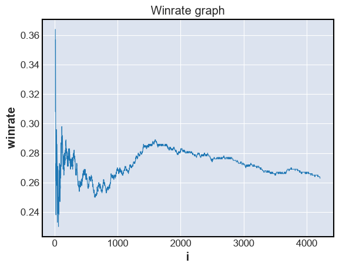</img>
</div>

## Second Model

**Dataset:** 518400 minutes of synthetic candles. Same stucture as 1440-m model

**Training:** 60 epochs, Adam (`lr=1e-3`), CrossEntropyLoss.

### Observation 

```
Epoch 12: train_loss=0.7328, val_acc=0.4929, val_f1=0.2201
Epoch 13: train_loss=0.7328, val_acc=0.4991, val_f1=0.2220
...
Epoch 60: train_loss=0.7328, val_acc=0.4929, val_f1=0.2201
```

`train_loss` is identical to 4 decimal places for **48 straight epochs**. `val_acc`/`val_f1` oscillate between exactly two values. At first glance this looks like a training bug (dead gradients, a model that stopped learning). Diagnostics (gradient norm checks, weight deltas between epochs, prediction distribution) showed the training loop itself was working correctly — weights were updating, gradients were nonzero, no NaN/Inf anywhere.

### Checking what the model actually converged to

The entropy of the class distribution in the training set was computed — this is the theoretical minimum `CrossEntropyLoss` achievable by a constant predictor that just reproduces class frequencies and ignores the input entirely:

```python
entropy(label_distribution) ≈ 0.7328
```

This matched the loss the model got stuck at **exactly**. In addition, the model's prediction distribution on the validation set closely mirrored the unconditional label distribution, regardless of the specific input window.


### Conclusion from the observation

The model found the **global optimum** — and that genuinely is the best achievable result, because the generator used here is an **i.i.d. random walk with no memory**: each price step is statistically independent of the previous ones. A 60-minute window of past candles carries, mathematically, zero information about future direction. This isn't a limitation of the LSTM or of training — it's a fundamental property of an efficient random walk (the efficient market hypothesis taken to its purest, most extreme form, with all structure stripped out).

**H1 is rejected** for this generator: the LSTM cannot extract signal that isn't there.
**H2 was not meaningfully testable** — moving from uniform → gauss → student_t changed the shape of the noise but added no autocorrelation or memory, so direction-prediction quality did not improve on any noise variant; all of them converged to the same entropy floor.


## Third & Next Models

**Dataset:** 346560/960000/3360000 minutes of synthetic candles with new structure, details below

**Training:** 50/400 epochs

### New DataSet structure

Instead of using a single huge chart, a large number of small charts are generated, each spanning 125 minutes (120 for input and 5 for prediction verification).

I also added checkpoints during model training.

### Evaluation

<div align="center"><b>Benchmark results</b></div>

<div align="center">
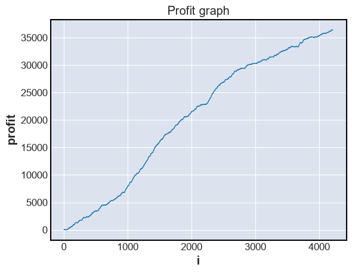</img>
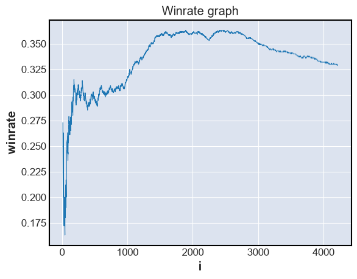</img>
</div>

This is the profit from the model trained on 346,560 minutes. Profit and win rate have increased significantly compared to the previous model, but there is a catch: **the results are exactly the same for all the other models** (960,000/3,360,000).

Every time, the model predicted `up` with the same probability of `50.34128`%. It discovered that `up` was the most frequent class in the training data and simply learned to always predict it, ignoring the input.

## What this means for using synthetic data in trading

This confirms a conclusion the whole experimentation process was pointing toward: **synthetic data based on a pure random walk is useless for training predictive models**, no matter how realistic individual candles look. For there to be anything worth predicting, the generator needs explicitly built-in structure:

- **Volatility clustering** (GARCH-like dynamics for sigma) — makes *volatility* predictable, even if *direction* stays random.
- **Momentum / mean-reversion** (autocorrelation in returns, e.g. an AR(1) component) — gives direction at least some memory.
- **Agent-based or GAN generators** — reproduce market reflexivity and real participant behavior, not just the statistical shape of returns.

In other words: **candles that look realistic ≠ candles that are predictable.** A realistic noise distribution (fat tails) improves the plausibility of individual moves, but doesn't by itself create the structure needed for learning — these are two independent dimensions of generator quality that are easy to conflate.

---

## Key technical lessons from the project

- `random` and `numpy.random` are independent state generators; reproducibility requires seeding both (or using isolated instances via `random.Random(seed)` / `np.random.default_rng(seed)`).
- Features of the form `(x - y) / close` blow up (NaN/Inf) if price is normalized around zero and can pass close to zero — normalize using rolling volatility instead of the raw price.
- Train/val splits for time series must be sequential in time (no shuffling at the raw-data level) — otherwise you get data leakage.
- A loss that's identical for many consecutive epochs isn't always "everything broke"; sometimes it means "the model already found everything there is to find" — worth comparing it against the label-distribution entropy before hunting for a bug.

---

## Possible next steps

- [ ] Add GARCH(1,1)-like volatility dynamics to the generator
- [ ] Add a weak momentum/mean-reversion component and check whether predictability emerges
- [ ] Compare LSTM / TCN / PatchTST on the same enriched generator
- [ ] Reframe the task as volatility prediction instead of direction (a more realistic target for random-walk-like processes)

---

## Stack

Python · PyTorch · pandas · parquet · scikit-learn (metrics) · numpy · matplotlib · mplfinance

---

*This is a learning experiment, not a trading recommendation or production system. The value isn't a "working strategy" — it's an honest hypothesis test and understanding of why naive synthetic data doesn't work.*
